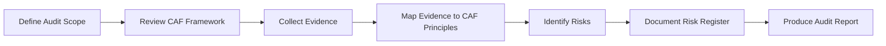

# Cyber Assessment Framework (CAF) Mini Audit

## Engagement Summary

This repository presents a simulated cyber assurance assessment conducted using the UK National Cyber Security Centre (NCSC) Cyber Assessment Framework (CAF).

The assessment evaluates organisational governance and cyber risk management practices aligned with CAF Objective A – Managing Security Risk.

The purpose of the exercise is to demonstrate practical understanding of cyber assurance methodologies used in regulated environments such as government, healthcare, and critical national infrastructure.

## Cyber Assurance Audit Workflow

## Framework Reference
This audit simulation is based on the UK National Cyber Security Centre (NCSC)
Cyber Assessment Framework (CAF), which is used by UK regulators and critical
national infrastructure organisations to assess cyber resilience. Available at https://www.ncsc.gov.uk/collection/caf

## Audit Report

The full simulated audit report can be found here:

report/CAF-Cyber-Assurance-Audit.pdf

## Repository Structure

Methodology/ – describes the cyber assurance audit approach

Evidence/ – mapping of organisational controls to CAF principles

Reference/ – supporting documentation for the CAF framework

Report/ – final simulated cyber assurance audit report

risk-register.md – risks identified during the assessment

## Objectives of the Project
- Demonstrate understanding of CAF assurance methodology
- Assess governance and cyber risk management practices
- Produce an evidence-based cyber assurance report

## Assessment Scope

The simulated assessment focuses on CAF Objective A – Managing Security Risk, including:

- A1 Governance
- A2 Risk Management
- A3 Asset Management
- A4 Supply Chain

The review examines governance structures, risk management processes, asset visibility, and third-party security controls.

## Methodology
The assessment reviewed organisational documentation and governance practices against CAF Indicators of Good Practice.

Evidence reviewed included:

- Information security policies
- Risk registers
- Asset inventories
- Supplier security requirements
- Governance reporting processes

## Key Findings

The assessment identified several potential areas for improvement:

• Lack of formal cyber security governance ownership  
• Incomplete documentation of cyber risk management processes  
• Limited visibility of organisational asset inventories  
• Absence of structured supplier security assurance procedures  

These findings are documented in the risk register and supported by evidence mapping against CAF principles.

## Maturity Assessment
Overall maturity rating:

**Amber – Developing**

| Impact | Likelihood | Risk Level |
| ------ | ---------- | ---------- |
| High   | High       | Critical   |
| High   | Medium     | High       |
| Medium | Medium     | Medium     |

## Project Outcome
This project demonstrates practical application of cyber governance and assurance concepts aligned with UK critical infrastructure security frameworks.

## Key Skills Demonstrated

• Cyber Assurance & Governance Review 
• Governance Risk & Compliance (GRC)  
• NCSC Cyber Assessment Framework (CAF)  
• Risk Identification & Documentation  
• Security Governance Review
• Evidence-based Security Assessment  
• Cyber Risk Reporting and Documentation

## Author
Patrick Adefowora  
Cyber Risk & Assurance Analyst
